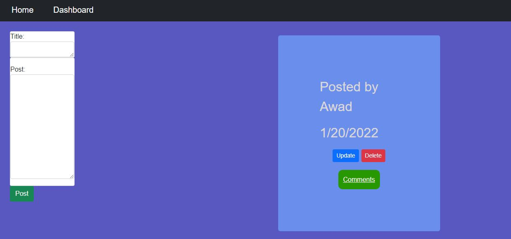

# Tech Blog

Tech Blog is a program that allows user to add, update and delete messages and works just like a messaging app.

The user can also see other people's posts and add comments to existing posts.

This was created using HTML, CSS, Javascript to define frontend/backend code, Express.js, Sequelize, and MySQL2 library to retrive information from SQL databases to allow users to 
login and send/update/delete messages.

# Login/Sign Up

Here the user is directed to the login/signup page. The user cannot see the post messages or comments until the user either creates a new account or logs in with an
existing account.

# Posts Dashboard

Once the user logs in or signs up with an account, the user will be directed to the dasboard page where either new messages can be created or can update/delete existing messages.

The user can also see the comments for each message by clicking on comments.

# Comments

When the user clicks on the 

